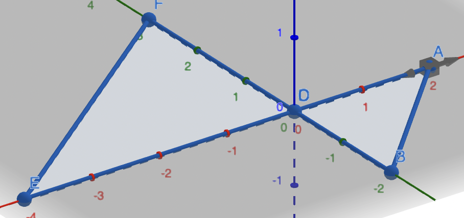
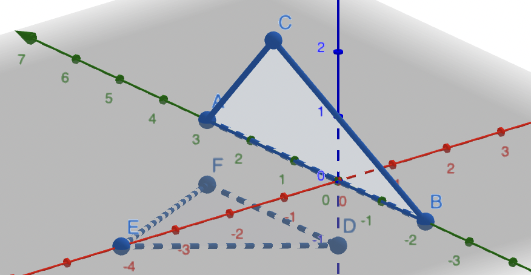
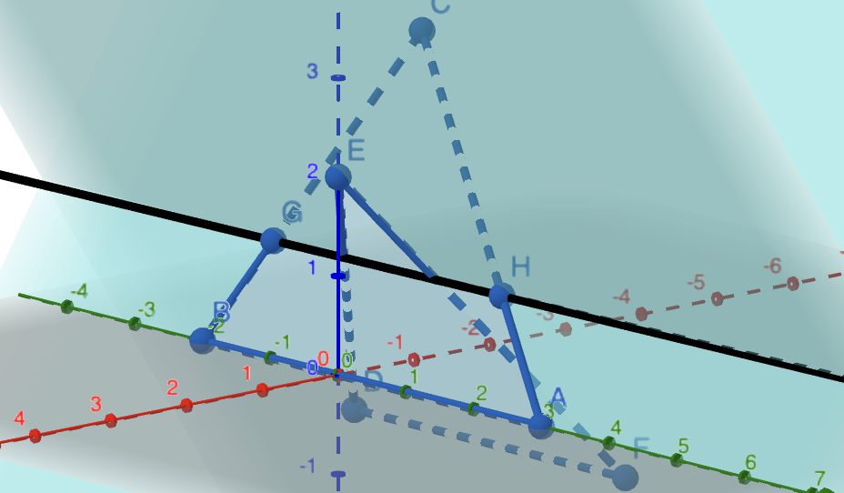

# Triangles-3D


## Установка и запуск проекта
Для установки
```
git clone git@github.com:Pelmeshka127/Triangles-3D.git

cd Triangles-3D
```
Запуск через Makefile
```
make

./triangles
```
Запуск через CMake
```
cmake -B build

cd build

cmake --build .

./triangles
```

В данный момент дорабатывается версия для CMake.

## Условие задачи

Со стандартного ввода приходит число 0 < N < 1000000, а потом N наборов точек, представляющих трёхмерные треугольники. Задача: вывести номера всех треугольников, которые пересекаются с каким-либо другим.

## Алгоритм

Для исследования взаимного расположения трегольников в пространстве рассмотрим 3 взаимоисключающие ситуации:

### 1: Треугольники лежат в параллельных плоскостях:

Если плоскости, в которых лежат труегольники параллельны, то треугольники не пересекаются.

Если же плоскости совпадают, то сначала проверим каждый отрезок одного треугольника на пересечение с каждым отрезком другого треугольника(прочитать о реализации этого алгоритма можно в книге Томаса Кормена "Алгоритмы: построение и анализ" в разделе вычислительной геометрии).
Если отрезки не пересекаются, то надо проверить не лежит ли один треугольник внутри другого. Если же и этот вариант не проходит, то пересечения нет.



### 2: Точки одного треугольника лежат по одну сторону от плоскости другого треугольника

Этот случай стоит рассмотреть отдельно, для облегчения алгоритма из следующего пункта.
Здесь мы находим расстояние от точек одного треугольника до плоскости другого (знаковое расстояние, не по модулю). Если все расстояния имеют один знак и не равны нулю, то треугольники не пересекаются.



### 3: Пересечение треугольников по линии пересечения их плоскостей

Если не выполняются предыдущие пункты, то остается только вариант, когда треугольники пересекаются по линии пересечения их плоскостей. Сначала мы находим прямую пересечения, затем на этой прямой находим отрезки, по которым треугольники пересекают плоскость. Если отрезки каким-либо образом перекрывают друг друга, то пересечение есть, иначе - нет.(Идея этого алгоритма рассказывается в книге Philip J. Scneider "Geometric tools for computer graphics" в разделе о пересечении треугольников в 3D).

